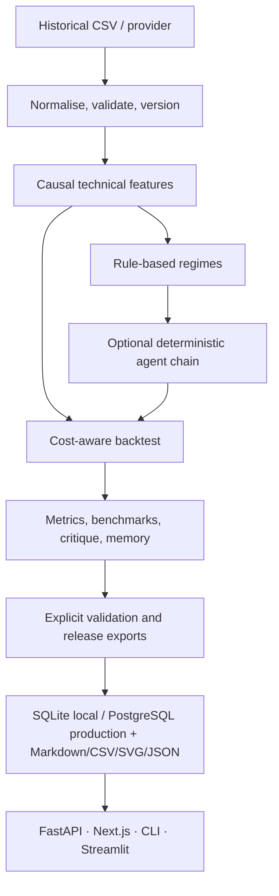

# FinAgent

FinAgent is a reproducible historical-research workspace for testing deterministic technical strategies on OHLCV data. It combines a Python research engine with a FastAPI service and a Next.js interface. It is deliberately not a broker, signal service, live-trading product, or financial-advice tool.

**V1.0.0 — Final Research Release** packages the established V0.1–V0.9 engine with a fixed, reproducible final evaluation suite, exported tables/chart, public-release documentation, and a verified demo. The research logic remains deterministic and unchanged.

## What problem it addresses

Historical strategy research is easy to make irreproducible: data can change, costs get omitted, validation can leak future observations, and decisions may be difficult to audit. FinAgent makes the experiment inputs, causal calculations, simulation results, data provenance, and validation evidence explicit and local.

## Features

- Deterministic baseline strategy simulation with configurable transaction costs.
- Causal rule-based market-regime detection and structured Technical → Regime → Strategy → Risk decisions.
- Deterministic Critic Agent and experiment memory; configuration-only, explicit V0.5 candidate evaluation.
- Opt-in V0.6 multi-asset, walk-forward, leakage, sensitivity, bootstrap, ablation, benchmark, and robustness diagnostics.
- Historical-data adapters, including backend-keyed Twelve Data with Yahoo Finance, Stooq, and local CSV fallback options; normalization, quality checks, deterministic cache paths, immutable revisions, collections, and durable PostgreSQL-backed OHLCV storage for production.
- FastAPI with typed schemas, pagination/filtering, request IDs, structured errors, local health state, and OpenAPI docs.
- Next.js research workspace with dashboard, explorer, data quality, charts, reports, errors/empty/loading states, and responsive navigation.
- Demo seed, environment check, safe SQLite health/backup/export commands, and one-command local startup.
- Deployment-ready FastAPI binding, explicit CORS origins, Render PostgreSQL Blueprint, Vercel environment wiring, and managed-database documentation.
- Fixed V1.0 release validation: two bundled fixtures, causal multi-asset walk-forward evaluation, leakage checks, sensitivity, bootstrap intervals, ablation, an explicit benchmark suite, and portable CSV/SVG/Markdown/JSON exports.

## Screenshots

The interface is intended to be read like a research notebook rather than a trading terminal.

- **Dashboard:** current experiment metrics, equity/benchmark comparison, drawdown, causal regime timeline, and local health.
- **Experiment explorer:** searchable, sortable, paginated historical experiment archive.
- **Data:** provider, quality score, warnings, checksum, adjustment metadata, coverage, and immutable revisions.
- **Validation:** multi-asset, walk-forward, sensitivity, and robustness evidence.

Run demo mode below to populate representative local views. The bundled fixtures are short deterministic release fixtures, not representative market histories or performance evidence.

## Quick start

Prerequisites: Python 3.11+, Node.js 20+ recommended, and npm.

```bash
git clone <your-repository-url>
cd FinAgent
python3 -m venv .venv
.venv/bin/pip install -e ".[api,dev,dashboard]"
cd frontend && npm install && cd ..
make check-env
```

Start the local application:

```bash
make dev
```

This runs FastAPI at `http://127.0.0.1:8000` and Next.js at `http://localhost:3000`. `Ctrl+C` stops both processes. Streamlit remains a separate legacy/debug interface:

```bash
.venv/bin/streamlit run dashboard/app.py
```

## Demo mode

Demo mode needs no key or network connection. It registers bundled CSV data, creates sample historical experiments, critic/memory records, a validation record, controlled-improvement history, and a Markdown report. Everything is marked as sample data and stored separately under `data/demo/`.

```bash
.venv/bin/python scripts/seed_demo.py
make dev
```

Or seed and start in one command:

```bash
make demo
```

Demo results are deterministic historical simulations—not performance claims and not an invitation to trade.

## Research workflow

Run a normal historical experiment:

```bash
.venv/bin/python scripts/run_experiment.py --config config/experiments.yaml
```

Run explicit V0.6 validation or V0.5 controlled candidate evaluation only when configured:

```bash
.venv/bin/python scripts/run_validation.py --config config/validation.yaml
.venv/bin/python scripts/run_improvement.py --config config/improvement.yaml
```

## V1.0 reference evaluation

The final reference suite is intentionally separate from normal local research data. It evaluates the two bundled fixtures with transaction costs, causal multi-agent decisions, critic/memory evidence, rolling walk-forward splits, leakage checks, sensitivity, bootstrap confidence intervals, ablation, and the fixed benchmark set. It never promotes or invents a self-improved configuration.

```bash
.venv/bin/python scripts/run_validation.py --config config/final_validation.yaml
.venv/bin/python scripts/export_release_artifacts.py --experiment EXP-000001 \
  --database data/release/finagent_v1.db --output reports/v1.0
```

On a clean `data/release/finagent_v1.db`, the validation anchor is `EXP-000001` and its validation is `VAL-000001`; an existing database will allocate the next identifiers. See [results](docs/RESULTS.md) for the committed reference output and [methodology](docs/RESEARCH_METHODOLOGY.md) for its limits.

Fetch/register bundled or public historical daily data:

```bash
.venv/bin/python scripts/fetch_data.py --provider local_csv --symbol EXAMPLE --start 2024-01-01 --end 2024-03-01 --source-path data/raw/example_ohlcv.csv
.venv/bin/python scripts/list_datasets.py
.venv/bin/python scripts/validate_dataset.py --dataset DATA-LOCAL-CSV-EXAMPLE-1D
```

For deployed historical-data ingestion, configure `TWELVE_DATA_API_KEY` only in the backend environment and select `auto` or `twelve_data`; the provider records actual-source provenance with every immutable revision. Yahoo Finance and Stooq remain optional public fallbacks and can be rate-limited or unavailable. Tests never call providers live. See [deployment instructions](docs/DEPLOYMENT.md) for the production AAPL smoke command.

## API

Start FastAPI on its own when needed:

```bash
.venv/bin/python -m uvicorn finagent.api.main:app --host 127.0.0.1 --port 8000
```

OpenAPI is at `http://127.0.0.1:8000/docs`. The API is local by default and only invokes the existing deterministic workflows. Collection endpoints use bounded `limit`/`offset`; experiments additionally accept `search`, `strategy`, `asset`, `regime`, `status`, date-range, and safe sort parameters. Dataset, candidate, validation, and decision history endpoints are similarly bounded.

Errors use a stable envelope:

```json
{
  "error_code": "DATASET_NOT_FOUND",
  "message": "Dataset not found: DATA-...",
  "details": null,
  "timestamp": "2026-01-01T00:00:00+00:00",
  "request_id": "..."
}
```

## Environment and database maintenance

```bash
.venv/bin/python scripts/check_environment.py
.venv/bin/python scripts/database_maintenance.py health
.venv/bin/python scripts/database_maintenance.py backup --output backups/finagent-$(date +%Y%m%d).db
.venv/bin/python scripts/database_maintenance.py export --output exports/experiment-summary.json
```

Backups and exports refuse to overwrite an existing target unless `backup --overwrite` is explicitly provided. No maintenance command deletes the source database.

## Architecture



Read [architecture notes](docs/ARCHITECTURE.md) and [research methodology](docs/RESEARCH_METHODOLOGY.md) for boundaries and data flow.

## Project structure

```text
finagent/              core research, data, persistence, API, service modules
config/                defaults, runnable examples, and safe demo configuration
scripts/               CLI runners, data tools, demo seed, health and maintenance tools
frontend/              Next.js local research workspace
dashboard/             legacy/debug Streamlit view
data/                  bundled sample data, local cache, and SQLite local database
docs/                  architecture, methodology, development, troubleshooting
tests/                 deterministic Python tests
```

## Version history

| Version | Scope |
| --- | --- |
| V0.1 | Backtesting, strategies, costs, metrics, CSV persistence |
| V0.2 | Causal rule-based market regimes |
| V0.3 | Deterministic Technical, Regime, Strategy, and Risk agents |
| V0.4 | Critic Agent and experiment memory |
| V0.5 | Explicit configuration-bounded candidate evaluation and promotion gate |
| V0.6 | Research validation and robustness diagnostics |
| V0.7 | FastAPI and Next.js local research workspace |
| V0.8 | Historical data providers, quality, cache, revisions, collections |
| V0.9 | Production polish, local operations, demo mode, UX and API consistency |
| V1.0.0 | Final deterministic evaluation suite, portable exports, release docs, and verification |

## Limitations and roadmap

FinAgent works with historical data and deterministic rules. It does not model all market frictions, guarantee future results, provide real-time data, authenticate users, or execute paper/live trades. Third-party historical-provider availability, plan limits, and coverage remain outside this project’s control. SQLite is retained for a single local user; managed PostgreSQL supports the documented Render deployment but does not turn FinAgent into a multi-user trading service.

Future work should remain evidence-driven and preserve reproducibility. It must not silently add LLM trading agents, reinforcement learning, sentiment analysis, brokerage integration, live/paper trading, authentication, or payments without an explicit versioned scope change.

## Verification

```bash
.venv/bin/python -m pytest -q
cd frontend
npm run check
npm test
npm run build
```

See the [architecture](docs/ARCHITECTURE.md), [methodology](docs/RESEARCH_METHODOLOGY.md), [results](docs/RESULTS.md), [demo](docs/DEMO.md), [development notes](docs/DEVELOPMENT.md), [troubleshooting](docs/TROUBLESHOOTING.md), and [release checklist](docs/RELEASE_CHECKLIST.md) for local operation and release evidence.

For public Render/Vercel deployment settings, including required CORS and managed PostgreSQL configuration, read [deployment instructions](docs/DEPLOYMENT.md).

## Disclaimer

FinAgent is educational/research software. All outcomes are simulated historical results and are not investment advice, trade recommendations, or guarantees of future performance.
