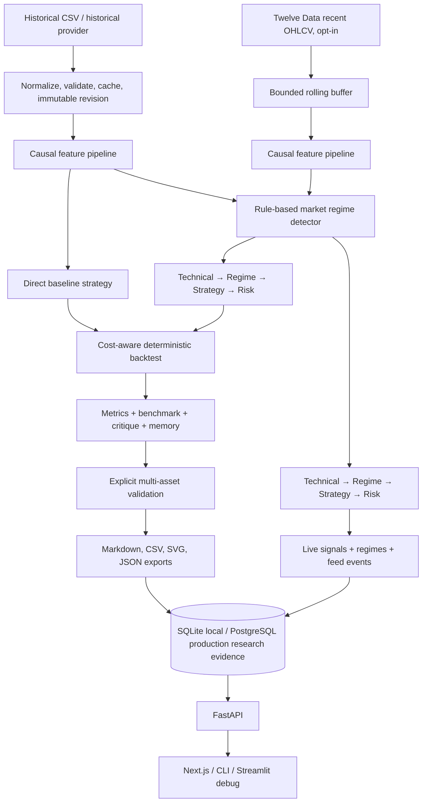

# FinAgent architecture

FinAgent is a layered deterministic research application. The boundary between layers is intentional: UI/API code reads or invokes validated orchestration, while calculation and persistence remain in typed Python modules. V1.1 adds a strictly separate, opt-in recent-market monitoring path; it is not connected to the historical backtest executor.

`finagent/runner.py` remains the compatible V0.1–V0.4 experiment entry point. `finagent/validation/` and `finagent/learning/` are opt-in and must be invoked explicitly. `finagent/services/research_service.py` is the thin orchestration boundary for FastAPI; routes do not directly calculate research results.

The persistence abstraction owns experiments, trades, metrics, regimes, agent records, critiques, memory, candidate history, validation evidence, manifests, and data revisions. SQLite remains the local backend with WAL, integrity checks, and explicit backups; PostgreSQL is the production backend with the same repository interfaces and versioned startup schema initialization. Atomic context-managed writes and foreign keys apply to both. The dataset registry never silently replaces a content revision and persists canonical OHLCV rows for production-safe retrieval.

The Next.js app never reads a database directly. Its typed client consumes only FastAPI responses and presents persisted data, bounded controls, loading/error/empty states, and clear historical/recent-data labels. The V1.0 release exporter reads only persisted validation evidence and produces a report, CSV tables, a dependency-free SVG chart, and a JSON record; it does not rerun an experiment. The V1.1 live page only reads bounded recent OHLCV, signals, regimes, and feed events from typed endpoints. For AAPL and other configured U.S. equities, `exchange_calendars` supplies the XNYS calendar; provider health, market state, and feed status remain distinct response fields.

## Safety boundaries

- All features and regimes are causal; no future observations are used in a decision.
- `agents.enabled: false` keeps the direct V0.1/V0.2 strategy path available.
- Critic and improvement outputs are evidence and configuration records, never autonomous code changes.
- Historical APIs call only the established local simulations; the separate live monitor is explicitly opt-in.
- Live signals are produced only from a completed received interval; current/in-progress candles are display data, not signal inputs.
- There are no accounts, broker calls, order creation, paper trading, or live execution. The Twelve Data credential is backend-only and never sent to the typed API/UI.
